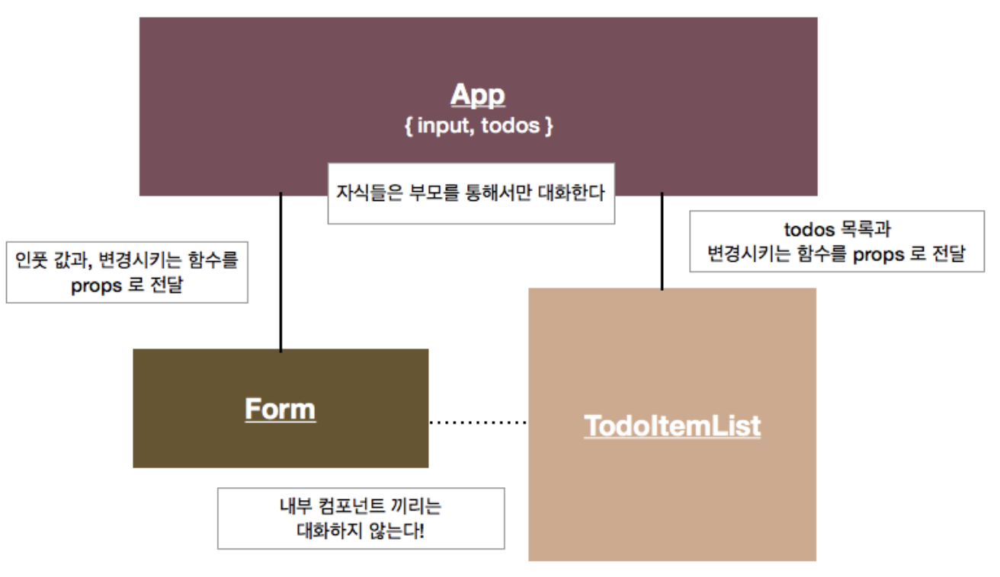
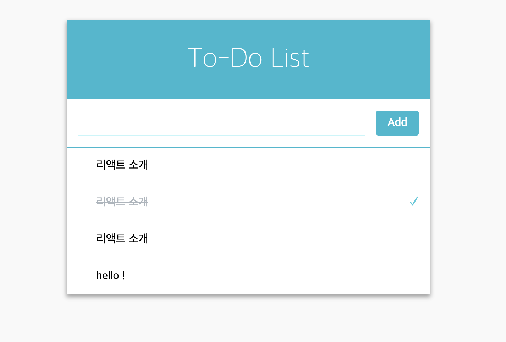
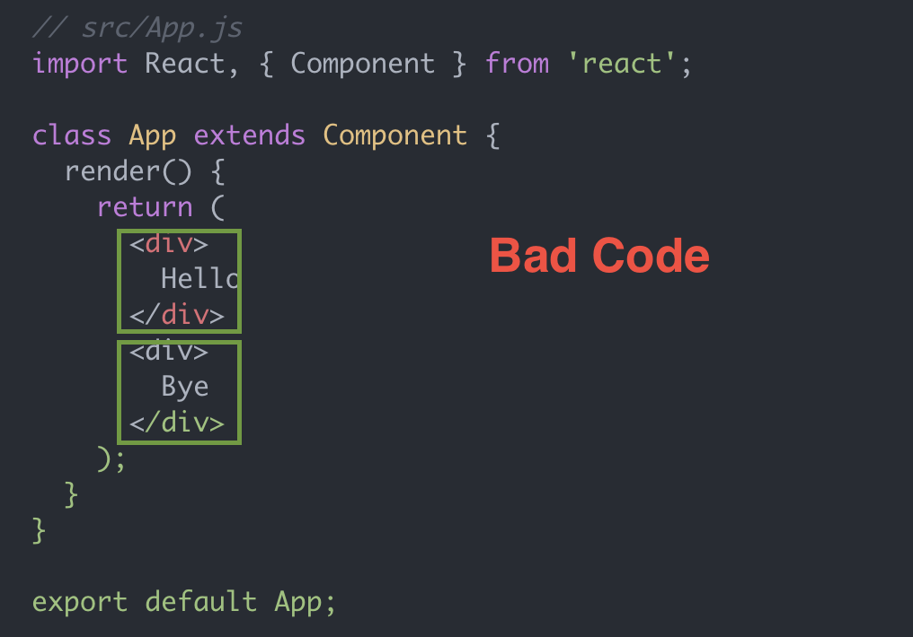
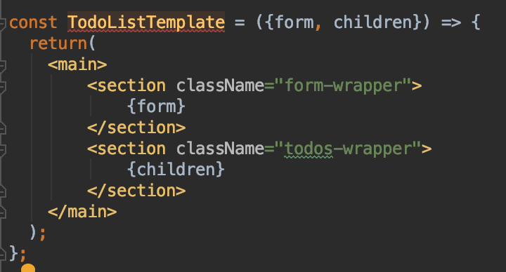

You can download project using :

### `git clone https://github.com/Minwoo-Kang/todo-list.git`

In the project directory, you can run:

### `npm start`

----

프로젝트 목표 :

`List` + `props` + `state` 를 이용해 간단한 To-Do List 를 만든다. 

Component 구조 :



최종 결과물 : 




----


Step 1. Template 만들기 

=> Wrapper vs Template

: `React`에서 `JSX`를 쓰기 위해선 하나의 `Component` 만을 return 할 수 있다.  



두 개 이상의 `Component` 를 쓰기 위해 여러 개의 `Component` 를 감싸는 형식으로 많이 사용한다.

단순히 감싸기 위한 `Wrapper` 와 `Template`방식이 있다.

* `Wrapper`
```
<TodoListWrapper><Form/><TodoList/></TodoListWrapper>
```

* `Template`


```
<TodoListTemplate form ={<Form />}> This data will be child in Template!</TodoListTemplate>
```

`Template`과 `Wrapper`의 차이는 단순히 감싸기만 하냐(`Wrapper`) 부모로 부터 전달받은 `props`를 직접 변수로 전달받아 
특정 형태를 갖추느냐(`Template`)의 차이이다.

어떠한 것을 선택해도 상관은 없으나, `Template`을 선택 할시 **각각의** `Component`에 대한 style 이나 
수정사항에 대해 유연하게 대처 할 수 있다고 한다.


------

Step 2. Item 입력 Form 만들기


----

Step 3. TodoItemList & TodoItem 만들기

----

Step 4. 상태 추가하기
=> 서로다른 Component 간 data 주고받기

(부모 Component 이용 !)

=> `push`를 쓰면 안되고 `concat`을 써야함 (swallow copy vs depp copy)

----

Step 5. Call back 함수 구현하기

 
